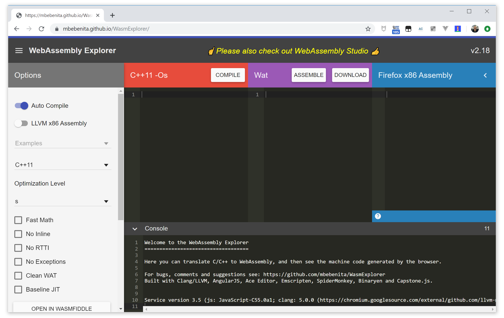
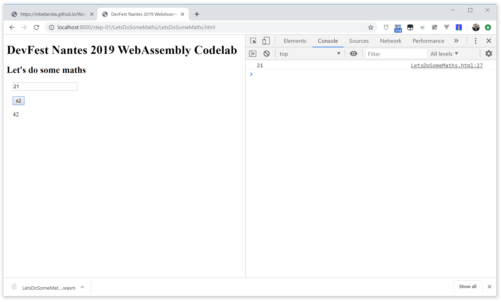

#  DevFest Nantes 2019 WebAssembly Codelab - Step 01 - Let's do some maths

This is the initial step of the tutorial. In this step we will define some simple math functions in C, we will compile it in WASM and we will call them from JS.

Remember, to see the app running in a browser, open a separate terminal/command line tab or window, go to the project directory and then start the web server. Now, open a browser window for the app and navigate to http://localhost:8000/app/ to see the current state of the app.

For the moment you have an empty HTML page that will point to the different demos we are going to code in this lab:

```html
<!DOCTYPE html>
<html lang="en">
<head>
    <meta charset="utf-8">
    <title>DevFest Nantes 2019 WebAssembly Codelab</title>
</head>
<body>
    <h1>DevFest Nantes 2019 WebAssembly Codelab</h1>
    
    <p>Here you have some WebAssembly demos:</p>

    <ul>        
    </ul>
</body>
</html>
```

## WebAssembly Explorer

[WebAssembly Explorer](https://mbebenita.github.io/WasmExplorer/) is an open source project and the associated website that allows you to compile your C/C++ code into WebAssembly, look at the generated WASM and WAT (Web Assembly Text format) and download it. 



It's a quick and easy way to compile C/C++ code into WASM without installing anything in your computer.

## Let's do some math

In this first demo we begin by writing a `doubler` function in C, compiling it in WASM, loading it from JavaScript and calling it atfer a DOM event. Not bad as first step, I reckon !

### Writing a `doubler` function

Put *WebAssembly Explorer* on C (C89 or C99) format and write a simple `doubler` function:

```c
int doubler(int a) {
    return 2*a;
}
```


Click on `Compile` and you will get your function compiler as  WASM and WebAssembly Text format (WAT), an human-readable version of the WASM code. 

In the WAT version you can see the stack-based flow of WebAssembly code:

```wat
(module
 (table 0 anyfunc)
 (memory $0 1)
 (export "memory" (memory $0))
 (export "doubler" (func $doubler))
 (func $doubler (; 0 ;) (param $0 i32) (result i32)
  (i32.shl
   (get_local $0)
   (i32.const 1)
  )
 )
)
```

The WAT shows two exports: a `memory` object (the shared memory between your WASM and the JS) and the `doubler` function.


Download the WASM file (rename it as `LetsDoSomeMaths.wasm`), and put it in your `app/LetsDoSomeMaths` folder.


### Load and instantiate the WASM

In order to use the `double()` function, you need to load and instantiate your WASM code. Create a `LetsDoSomeMaths.js` file that will do the job.

The first thing you will need in your JS file is a configuration object that you will use to pass information at the WASM instantiation (shared memory, imported functions...). For this first use case, it will be an empty object:

```js
let configurationObject = {
}
```

As we are exporting the `doubler` function in JavaScript world, we declare a varuable for it:

```js
let doubler;
```

Now we create a `loadWASM()` function where we will load and instantiate the `.wasm` file. As in the function we are doing lots of asynchronous operations (network fetching, transformations, WASM instantiation...), we will use an `async` function to we able to use the [`async/await`](https://developer.mozilla.org/en-US/docs/Web/JavaScript/Reference/Statements/async_function) pattern and write more linear code. 


```js
async function loadWASM() {

}
```

Let's begin by using the [Fetch API](https://developer.mozilla.org/en-US/docs/Web/API/Fetch_API) to load the `.wasm` file:

```js
    let response = await fetch('./LetsDoSomeMaths.wasm');
```


Then we take the HTTP response containing the WASM code and we trasnsform it in a byte array ([ArrayBuffer](https://developer.mozilla.org/en-US/docs/Web/JavaScript/Reference/Global_Objects/ArrayBuffer) in JS):

```js
    let arrayBuffer = await response.arrayBuffer();
```

And now we ask the browser to instantiate this ArrayBuffer as a WASM module, using the WASM API:

```js
    let wasmModule = await WebAssembly.instantiate(arrayBuffer, configurationObject);
```

As now we have an instantiated WASM module, we can look for the exported `doubler()` function.

```js
    doubler = await  wasmModule.instance.exports.doubler;
```

And then, at the end of the file, we simply call `loadWASM()` to launch the process:

```js
loadWASM();
```
The whole JS file should look something like that:

```js
let configurationObject = {
}

let doubler;

async function loadWASM() {
    let response = await fetch('./LetsDoSomeMaths.wasm');
    let arrayBuffer = await response.arrayBuffer();
    let wasmModule = await WebAssembly.instantiate(arrayBuffer, configurationObject);
    doubler = await  wasmModule.instance.exports.doubler;
}

loadWASM();
```


### Doing some HTML

In `app/index.html`, we add a pointer to this first demo:

```html
    <ul> 
        <li>
            <a href="./LetsDoSomeMaths/LetsDoSomeMaths.html">
                Let's do some maths
            </a>
        </li>        
    </ul>
```

Now we cat create a `LetsDoSomeMaths.html` file in the `app/LetDoSomeMaths` folder, and add some UI elements:

- An input field
- A *x2* button that will call the `doubler` function
- An empty `div` to display the result

The all with a very minimalist layout (this isn't a CSS lab after all... 😉) 

```html
<!DOCTYPE html>
<html lang="en">
<head>
    <meta charset="utf-8">
    <link rel="shortcut icon" href="data:image/x-icon;," type="image/x-icon"> 
    <title>DevFest Nantes 2019 WebAssembly Codelab - Let's do some maths</title>
    <style>
        .row { margin: 16px; display: flex; flex-flow: row; }
    </style>
</head>
<body>
    <h1>DevFest Nantes 2019 WebAssembly Codelab</h1>
    <h2>Let's do some maths</h2>
    
    <div class="row">
        <input id="input" type="number">
    </div>
    <div class="row">
        <button id="doublerBtn">x2</button>
    </div>
    <div id="result" class="row"></div>
</body>
</html>
```

Now we call the `LetsDoSomeMaths.js` script:

```html
<script src="./LetsDoSomeMaths.js"></script>
```

### Adding the event listener

We would like to call the `doubler` function when the user clicks on the *x2* button, and doubling the value of the input field.

In order to do that, we place an `onclick` listener on the button, and we call a function that will get the value from the input field and pass it to `doubler`. Then the function will get the result and put in the the `result` element.

```html
    <button id="doublerBtn" onclick="callDoubler()">x2</button>

   [...]

   <script>
       function callDoubler() {
           let val = document.getElementById('input').value;
           let doubled = doubler(val);
           let result = document.getElementById('result');
           result.innerText = doubled;
       }
   </script>

```

Now your *x2* button should work as intended:





## Conclusion

We have done our first WASM function, let's play a bit with it now...
In the [next step](./step-02) you will see how typing works on WASM.
