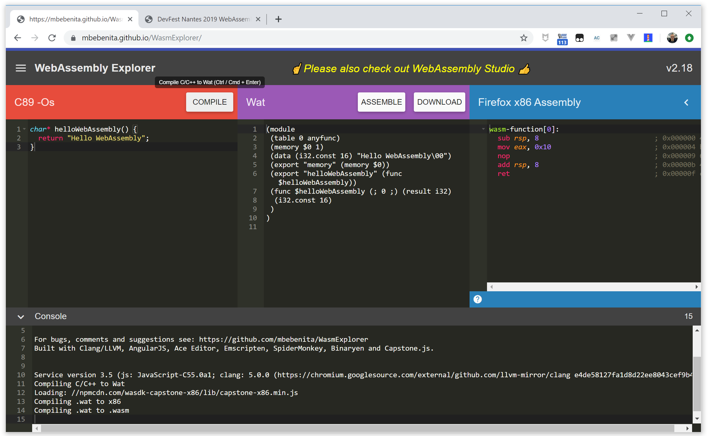

In this step we are going to add the first demo, *Hello WebAssembly*, our version of the Hello World.

## Hello WebAssembly in C

Let's write a simple Hello WebAssembly function in C:

```c
char* helloWebAssembly() {
  return "Hello WebAssembly";
}
```

This function will give us a pointer to a char buffer containing the `Hello WebAssembly` string. This buffer will be in the shared linear memory between WASM and JS.

Put it in [WebAssembly Explorer](https://mbebenita.github.io/WasmExplorer/), select C89 or C99 formats, and click on *Compile*. 




You will get the WASM and the WebAssembly Text format (WAT) versions of your code.

The WAT is an human-readable version of the WASM code, where you can see the stack-based flow of WebAssembly code:

```wat
(module
 (table 0 anyfunc)
 (memory $0 1)
 (data (i32.const 16) "Hello WebAssembly\00")
 (export "memory" (memory $0))
 (export "helloWebAssembly" (func $helloWebAssembly))
 (func $helloWebAssembly (; 0 ;) (result i32)
  (i32.const 16)
 )
)
```

In your code you declared a `helloWebAssembly()` function, in WASM this function is exported (in the `(export "helloWebAssembly" (func $helloWebAssembly))` line) and made available to use in your JS environment.

Download the WASM file (rename it as `HelloWebAssembly.wasm`), and put it in your `app/HelloWebAssembly` folder.


## Loading your WASM code

In order to use the `helloWebAssembly()` function, you need to load and instantiate your WASM code. Create a `HelloWebAssembly.js` file that will do the job.

The first thing you will need in your JS file is a configuration object that you will use to pass information at the WASM instantiation (shared memory, imported functions...). For this first use case, it will be an empty object:

```js
let configurationObject = {
}
```

Now we create a `loadWASM()` function where we will load and instantiate the `.wasm` file. As in the function we are doing lots of asynchronous operations (network fetching, transformations, WASM instantiation...), we will use an `async` function to we able to use the [`async/await`](https://developer.mozilla.org/en-US/docs/Web/JavaScript/Reference/Statements/async_function) pattern and write more linear code. 

```js
async function loadWASM() {

}
```

Let's begin by using the [Fetch API](https://developer.mozilla.org/en-US/docs/Web/API/Fetch_API) to load the `.wasm` file:

```js
    let response = await fetch('./HelloWebAssembly.wasm');
```

Then we take the HTTP response containing the WASM code and we trasnsform it in a byte array ([ArrayBuffer](https://developer.mozilla.org/en-US/docs/Web/JavaScript/Reference/Global_Objects/ArrayBuffer) in JS):

```js
    let arrayBuffer = await response.arrayBuffer();
```

And now we ask the browser to instantiate this ArrayBuffer as a WASM module, using the WASM API:

```js
    let wasmModule = await WebAssembly.instantiate(arrayBuffer, configurationObject);
```

As now we have an instantiated WASM module, we can look for the exported `helloWebAssembly()` function.

```js
    let helloWebAssembly = await  wasmModule.instance.exports.helloWebAssembly;
```

The whole JS file should look something like that:

```js
let configurationObject = {
}

async function loadWASM() {
    let response = await fetch('./HelloWebAssembly.wasm');
    let arrayBuffer = await response.arrayBuffer();
    let wasmModule = await WebAssembly.instantiate(arrayBuffer, configurationObject);
    let helloWebAssembly = await  wasmModule.instance.exports.helloWebAssembly;
}
```

## Calling the function and dealing with the linear memory

Calling the `helloWebAssembly()` will give us a pointer to the linear memory position where WASM has written the *Hello WebAssembly* message.

Let's do a function to get this pointer and iterate throught the shared memory to read the characters and build the string.

Let's begin by getting the shared memory buffer from the WASM instace:

```js
    let buffer = new Int8Array(wasmInstance.exports.memory.buffer);
```

And now, let's read the buffer from the position indicated by the pointer, and add the `char` to the string: 

```js
    let str = "";
    for (i = pointer; buffer[i]; i++) {
      str += String.fromCharCode(buffer[i]);
    }
    return str;
```

The function then looks like:

```js
function readWASMbuffer(wasmInstance, pointer) {
    let buffer = new Int8Array(wasmInstance.exports.memory.buffer);
    let str = "";
    for (i = pointer; buffer[i]; i++) {
      str += String.fromCharCode(buffer[i]);
    }
    return str;
}
```

Now in the `loadWASM()` function, we can call `readWASMbuffer()`:

```js
async function loadWASM() {
    let response = await fetch('./HelloWebAssembly.wasm');
    let arrayBuffer = await response.arrayBuffer();
    let wasmModule = await WebAssembly.instantiate(arrayBuffer, configurationObject);
    let helloWebAssembly = await  wasmModule.instance.exports.helloWebAssembly;    
    
    let str = readWASMbuffer(wasmModule.instance, helloWebAssembly());
    console.log(str);
}
```

And then, at the end of the file, we simply call `loadWASM()` to launch the process:

```js
loadWASM();
```

## Adding some HTML

We have the C source, the compiled WASM, the JavaScript to instantiate it, let's end by creating a simple HTML to call this JavaScript.

Create a `HelloWebAssembly.html` file in the same `app/HelloWebAssembly` folder:

```html
<!DOCTYPE html>
<html lang="en">
<head>
    <meta charset="utf-8">
    <title>DevFest Nantes 2019 WebAssembly Codelab - Hello WebAssembly</title>
</head>
<body>
    <h1>DevFest Nantes 2019 WebAssembly Codelab</h1>
    <h2>Hello WebAssembly</h2>
    
    <p>
        We are using a `helloWebAssembly()` 
        function written in C, compiled into WASM
        and loaded and instantiated via JS. 
    </p>

    <p>
        Look at the console, it it works you should see
        a `Hello WebAssembly` message.
    </p>
</body>
</html>
```

Link it from the `index.html` file in the `app` folder:

```html
    <ul> 
        <li>
            <a href="./HelloWebAssembly/HelloWebAssembly.html">
                Hello WebAssembly
            </a>
        </li>       
    </ul>
```

So now, in your `HelloWebAssembly.html` file, you can simply load the `HelloWebAssembly.js` file:

```html
<script src='./HelloWebAssembly.js'></script>
```

And if you look at the console, you will see the `Hello WebAssembly` message showing that the WASM was correctly loaded and called and that the message was passed in the shared memory.