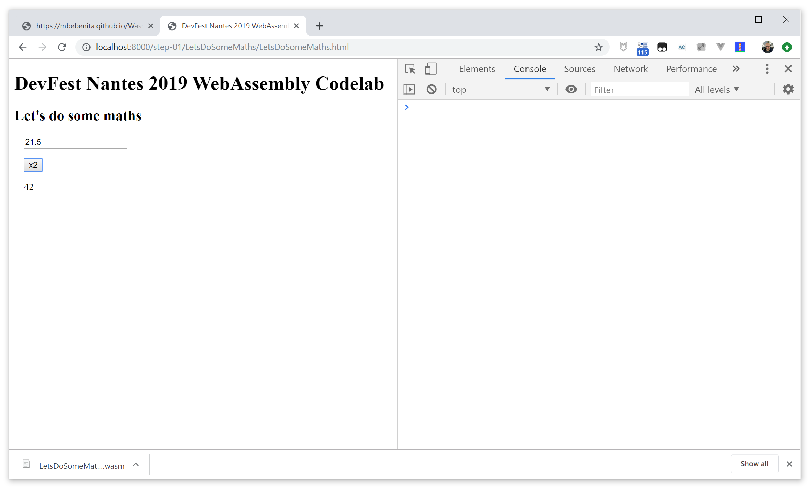
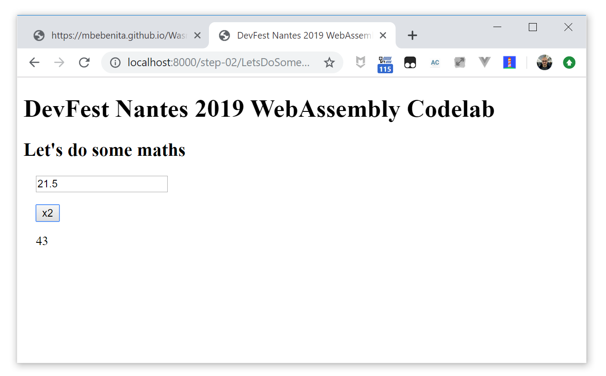

#  DevFest Nantes 2019 WebAssembly Codelab - Step 02 - Types, more functions

## Types are important

WASM is a typed format. We have declared our `doubler` function as taking an `int` parameter. What happens if we give it something else?

Let's try with a `float` parameter. Put `21.5` as input value and see what happens...




As you can see, the `float` input is truncated. Not bad, but not specially good...

### WASM types

WASM currently has four available types:

- i32: 32-bit integer
- i64: 64-bit integer
- f32: 32-bit float
- f64: 64-bit float

Types from langages compiled to WASM are mapped to these types in a suitable way for each langage. 

In JavaScript there aren't types, so some care has to be done to explicitely do the good conversions when dealing with data to/from WASM.

### Making a more generic `doubler`

Let's modify our C source code to receive a `double` parameter and return a `double` result:

```c
double doubler(double a) {
    return 2*a;
}
```

Generate the WASM and replace the old `.wasm` file with the new one.


And now our WASM also works with non-integer numbers:




## Adding some more functions

Taking as base what we have done until here, let's extend our demo to do some other basic functions:

- `square`: returns the square of the input
- `half`: returns the half of the input
- `addition`: takes two parameters and returns the sum
- `substraction`: takes two parameters and returns the difference
- `product`: takes two parameters and returns the product
- `division`: takes two parametes and returns the division

The UI should look like:


