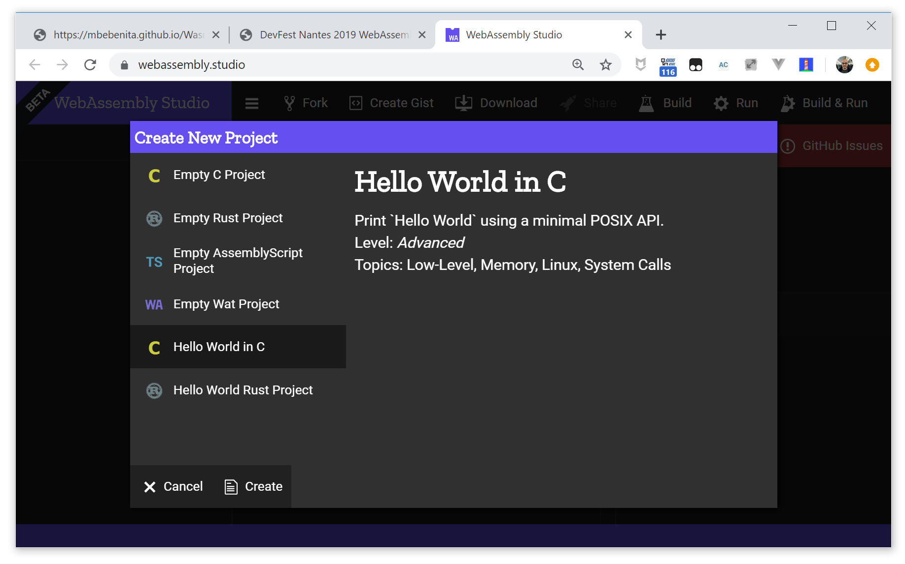
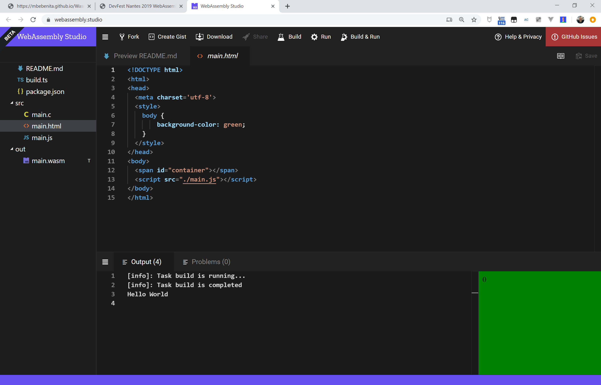
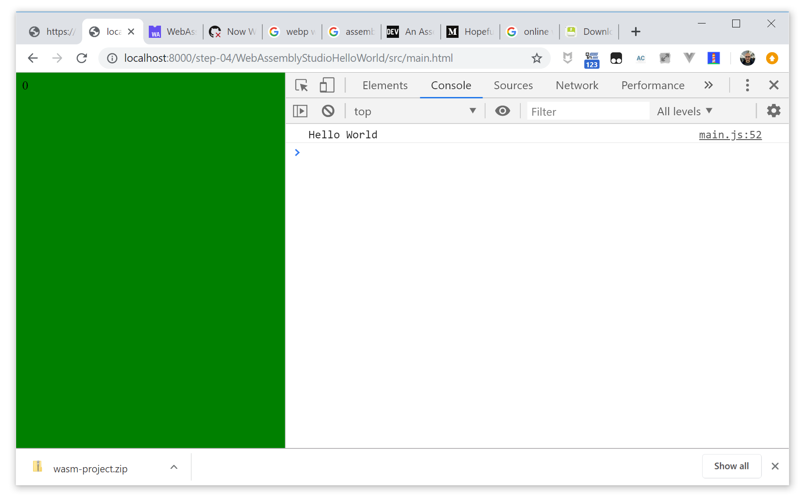

#  JFokus 2020 WebAssembly Codelab - Step 04 - Using WebAssembly Studio

[WebAssembly Studio](https://webassembly.studio/) is an online IDE for WASM that allows you to develop complete WASM projects in C/C++, Rust and AssemblyScript (TypeScript subset to generate WASM) in a simple way without installing anything in your workstation.

We are going to use *WebAssembly Studio* to generate a new version of *Hello WebAssembly*, this time using the full toolchain of Emscripten.



This section of the tutorial is completly based on WebAssembly Studio's own Hello Wolrd in C tutorial.

## Hello WebAssembly in a new way

Go to WebAssembly Studio and choose *Create New Project -> Hello World in C*. We are going to print `Hello World` in the console, but instead of implementing it using JavaScript's `console.log`, we are using the C `printf` function. This function in turn uses several POSIX APIs that are implemented in JavaScript using DOM APIs.

### Project Overview

There are two main files in the project:

- `main.c` - Imports `stdio.h` and calls `printf("Hello World")`.
- `main.js` - Initializes a runtime environment for the WebAssembly module and implements the necessary WebAssembly imports.

### Things to Explore

1. Click *Build* to compile `main.c` file to `out/main.wasm`.

1. Open the `out/main.wasm` file and notice that there's quite a bit of code. This is somewhat surprising given that our program is so small. The vast majority of this code implements the printf function.

1. Notice the imports section, these are `SysCalls`. To get this WebAssembly module running you'll have to implement these functions first. However, note that these import names don't actually tell you what `SysCalls` are used, they are merely function stubs (one for each number of parameters).

    ```lisp
    (import "env" "__syscall0" (func $env.__syscall0 (type $t2)))
    (import "env" "__syscall3" (func $env.__syscall3 (type $t5)))
    (import "env" "__syscall1" (func $env.__syscall1 (type $t8)))
    ...
    ```

1. To figure that out which `SysCalls` are being used, you'll have to run the module. I ran it and got 45, 146 and 192. You can figure out what these numbers mean by looking them up in the Linux SysCall Reference. They are brk(), writev() and mmap(). To make this WebAssembly module run, you'll just have to implement a tiny Linux kernel in JavaScript, no biggie.

1. Take a look at `src/main.js`, this file emulates these basic `SysCalls` in JavaScript.

    - `brk()` can be stubbed to return `0`, which is the success error code. `brk()` is used to allocate more memory to a process. WebAssembly does handles memory differently, so there's no need to do special here.

    - `mmap2()` is used to request more memory within the process. In our example, it's implemented as a call to the WebAssembly `memory.grow()` function.

    - `writev()` is used to write data to files. Its signature is `writev(int fd, const struct iovec *iov, int iovcnt)`. We can ignore the fd file descriptor parameter, and focus on the `iov` structure. The problem here is that on the JavaScript side we have a hard time pulling the struct `iovec` abart. We could figure it out, but a neat hack is to call back into the WebAssembly module and have some C code unpack it for us.

1. Click *Run*





## Download and add to the demo suite

You can download the whole project from WebAssembly Studio and execute it in your local project.

Modify your `app/index.html` file to add the new demo:

```html
    <li>
        <a href="./WebAssemblyStudioHelloWorld/src/main.html">
            Hello World with WebAssembly Studio 
        </a>
    </li>
```

And you have the new demo:




## Conclusion

In the [next step](../step-05/) you are going to use WebAssembly Studio to compile an existing library, an AssemblyScript implementation of [Conway's Game of Life](https://en.wikipedia.org/wiki/Conway%27s_Game_of_Life).