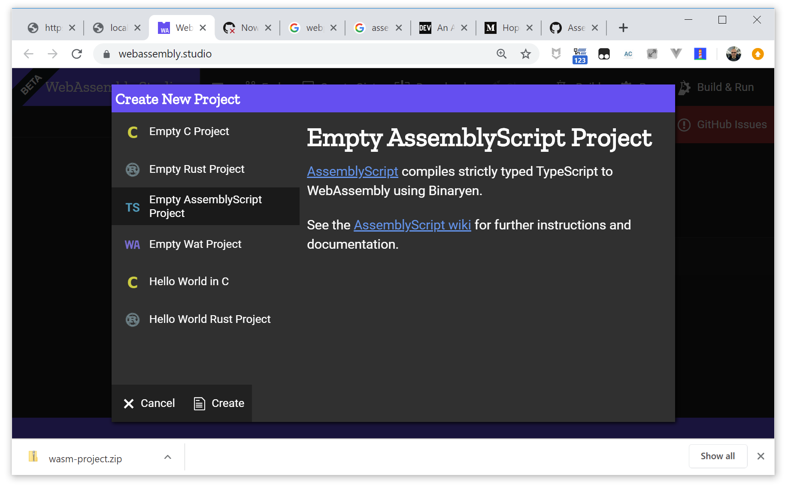
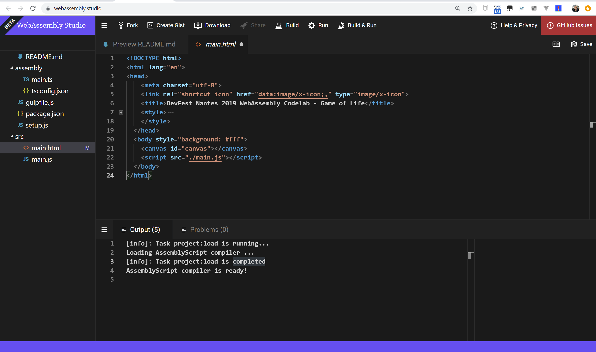
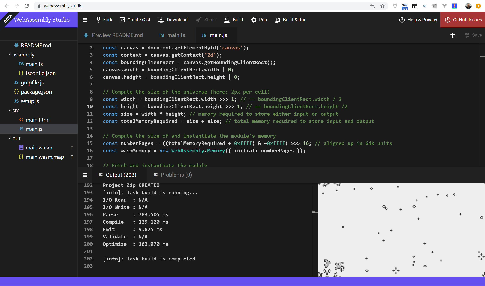

#  JFokus 2020 WebAssembly Codelab - Step 04 - Using WebAssembly Studio - Conway's Game of Life

In this step we are building a [Conway's Game of Life](https://en.wikipedia.org/wiki/Conway%27s_Game_of_Life) demo, using an [AssemblyScript](https://github.com/AssemblyScript/assemblyscript) library.

## Everything begins with a project

Let's begin by creating a new empty AssemblyScript project on WebAssembly Studio.



In the `main.html`, add a `canvas` element, that will be the *board* for the Game of Life.

```html
<!DOCTYPE html>
<html lang="en">
<head>
    <meta charset="utf-8">
    <link rel="shortcut icon" href="data:image/x-icon;," type="image/x-icon"> 
    <title>JFokus 2020 WebAssembly Codelab - Game of Life</title>
    <style>
      html,
      body {
        height: 100%;
        margin: 0;
        overflow: hidden;
      }
      canvas {
        width: 100%;
        height: 100%;
      }
    </style>
  </head>
  <body style="background: #fff">
    <canvas id="canvas"></canvas>
    <script src="./main.js"></script>
  </body>
</html>
```




## Game of Life, AssemblyScript style

The Game of Life is one of the most implemented algorithms, you can find implementation in most languages. In the AssemblyScript repository, we can find a [clean and simple implementation](https://github.com/carlosbaraza/wasm-game-of-life/blob/master/assembly/main.ts).


> ### The Game of Life
> 
> The universe of the Game of Life is an infinite two-dimensional
orthogonal *board* composed of square *cells*, each of which is in one
of two possible states, alive or dead.
>
> Every cell interacts with its eight neighbours, which are the cells that are horizontally, vertically, or diagonally adjacent.
>
> At every step of the algorithm, all the *cells* are scanned. 
> - A live *cell* with fewer than 2 live neighbors dies, as if caused by underpopulation. 
> - A live *cell* with more than 3 live neighbors dies, as if by overpopulation.
> - A live *cell* with 2 or 3 live neighbors lives on to the next generation.
> - A dead *cell* with exactly 3 live neighbors becomes a live cell, as if by reproduction.

There is no need to understand the library to do the codelab, but it always help. Let's look at it...


[AssemblyScript types](https://docs.assemblyscript.org/basics/types) can be surprising at the first gaze, as they are rather low level:
`bool`, `i8`, `i16`, `i32`, `i64`, `i8`, `i16`, `i32`, `i64`, `f32`, `f64`...

In the library, only two types are used: 

- `i32`: a 32-bit unsigned integer
- `u8`: an 8-bit unsigned integer

They are two functions exported in the code:

1. The `init` function builds a *game board* according to the dimensions given as parameters

    ```ts
    export function init(inputWidth: i32, inputHeight: i32): void 
    ```

1. The `step` function executes a step of the Game of Life algorythm

    ```ts
    export function step(): void
    ```

As you can see, the AssemblyScript library only does the *backend* tasks, the processing. It's the ideal use case for WebAssembly. But how can we pass from this implementation to something drawn in the `canvas`? That's the role of the JavaScript glue code that we are going to build now.


## The JavaScript glue

The JavaScript role is to be the bridge between the DOM and the WASM worlds. All the DOM manipulations must be done in the JS.

Let's begin by the code to define the canvas and make it take the size of its bounding box:

```js
// Set up the canvas with a 2D rendering context
const canvas = document.getElementById('canvas');
const context = canvas.getContext('2d');
const boundingClientRect = canvas.getBoundingClientRect();
canvas.width = boundingClientRect.width | 0;
canvas.height = boundingClientRect.height | 0;
```

Now we define the size of our gaming universe. Let's begin with something simple, a *cell* size of 2px by 2px.

```js
const width = boundingClientRect.width >>> 1; // == boundingClientRect.width / 2
const height = boundingClientRect.height >>> 1; // == boundingClientRect.height /2
const size = width * height; // memory required to store either input or output
const totalMemoryRequired = size + size; // total memory required to store input and output
```

 Memory in WASM is defined in 64KB pages. We need to define the memory size we need for our game.

```js
// Compute the size of and instantiate the module's memory
const numberPages = ((totalMemoryRequired + 0xffff) & ~0xffff) >>> 16; // aligned up in 64k units
const wasmMemory = new WebAssembly.Memory({ initial: numberPages });
```

Then we can instantiate the module:

```js
// Fetch and instantiate the module
WebAssembly.instantiateStreaming(fetch('../out/main.wasm'), {
  env: { memory: wasmMemory }
})
  .then(initGame)
  .catch(err => {
    throw err;
  });
```

The `initGame()` function will initiate the game (how surprising... 😉):

```js

// Executed when the WASM module is instantiated
function initGame(module) {
    const exports = module.instance.exports;

    // Tell the module about the universe's width and height
    exports.init(width, height);

    // Fill input at [0, s-1] with random live cells
    const memory = new Uint8Array(wasmMemory.buffer);
    for (let y = 0; y < height; ++y)
    for (let x = 0; x < width; ++x)
        memory[y * width + x] = Math.random() > 0.1 ? 0 : 1;

    // Update about 30 times a second
    const desiredFps = 30;
    const frameDuration = 1000 / 30;
    function update() {
        // To be done
    }
    // Poorly optimised render function
    // Easily bigger bottleneck than the actual module
    function render() {
        // To be done
    }
    update();
    render();
}    
```

The `update()` funtion will execute the step, and copy the output of the step to the input, readying it for next step:

```js
    function update() {
        setTimeout(update, frameDuration);
        exports.step();
        // copy output at [size, totalMemoryRequired] to input at [0, size]
        memory.copyWithin(0, size, totalMemoryRequired);    
    }
```

The `render()` is a simplist and awfully underperformant function to read the memory and put the info on the canvas:

```js
    function render() {
        requestAnimationFrame(render);

        context.fillStyle = 'rgba(238,238,238,0.67)';
        context.fillRect(0, 0, width << 1, height << 1);
        context.fillStyle = '#333';

        for (var y = 0; y < height; ++y)
            for (var x = 0; x < width; ++x)
                if (memory[size + y * width + x])
                    context.fillRect(x << 1, y << 1, 2, 2);
    }
```    

## Configuring Gulp

We need to include the flag `--importMemory` in the  `asc.main()` as we want to have access to the `WebAssembly.Memory` object within the JS orchestrator.

## Build an run

Build and run the project on WebAssembly Studio to see your Game of Life in action




## Download and run it in local

As we did in the precedent step, we are going to download the WebAssembly project to run it in local.

### Add the demo to the global index

Edit `app/index.html` to add the Game of Life demo:

```html

        <li>
            <a href="./GameOfLife/src/main.html">
                Game of Life in AssemblyScript 
            </a>
        </li>
```


### Download and extract the code

Download the zip file with your WebAssembly Studio project and decompress in in `app/GameOfLife` folder.

Now everything should work, in a perfect world. But if you go to
`app/GameOfLife/src/main.html`, you will see that the WASM isn't loaded,
and you will have a rather cryptic message on the console:

```log
main.html:1 Uncaught (in promise) TypeError: Failed to execute 'compile' on 'WebAssembly': Incorrect response MIME type. Expected 'application/wasm'.
```

The problem here is that Chrome expects that files loaded with `WebAssembly.instantiateStreaming()` arrive with the `application/wasm` MIME type, and your local Python or NodeJS server doesn't sets this type.

A solution is to modify the instatiation as we did in the first examples:


```js
// Fetch and instantiate the module
async function loadAndInstantiate() {
    let response = await fetch('../out/main.wasm');
    let arrayBuffer = await response.arrayBuffer();
    let wasmModule = await WebAssembly.instantiate(arrayBuffer, 
        { env: { memory: wasmMemory } });
    initGame();
}
loadAndInstantiate(wasmModule);
```

And then the instantiation works as intended, and you have your Game of Life running locally:


