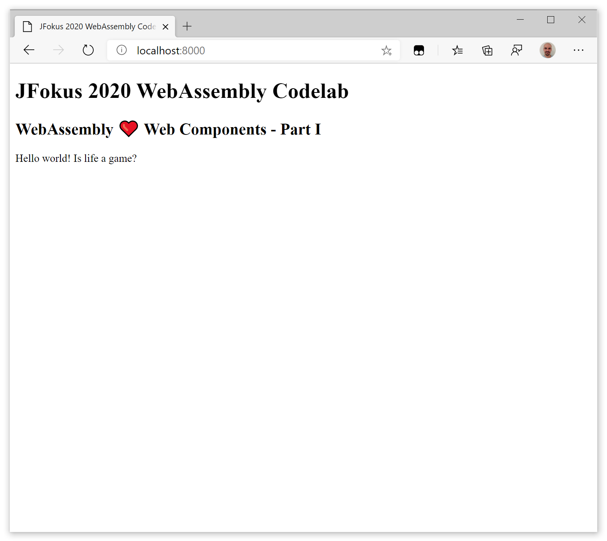
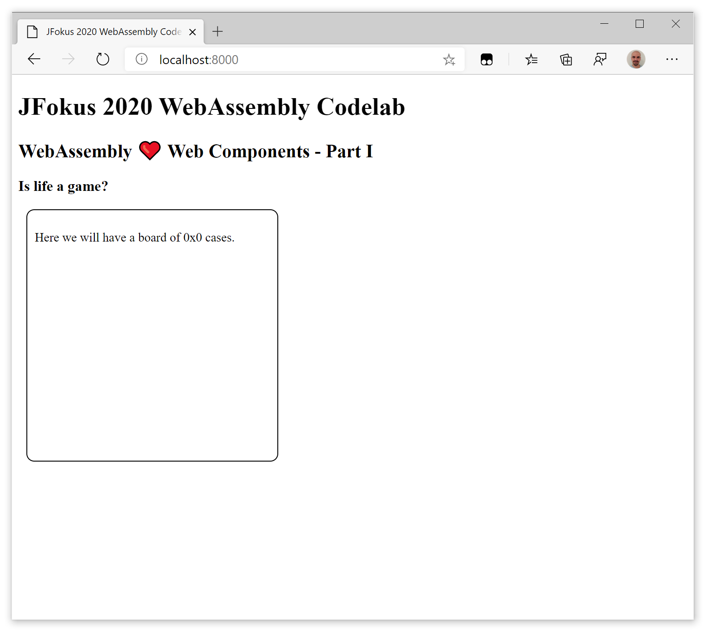

#  JFokus 2020 WebAssembly Codelab - Step 06 - WebAssembly ❤️ Web Components - Part I

In the two following steps, we will use [Web Components](https://www.webcomponents.org/) to encapsulate the Wasm file and the associated JavaScript into a [custom element](https://html.spec.whatwg.org/multipage/custom-elements.html) easy and painless to use in any JS framework... or without any framework at all.

In this part I, we will begin by creating a web component using using one of the most popular web components library, [Lit Element](https://lit-element.polymer-project.org/).


## Hiding the complexity

Until this step, using our Wasm modules in a JS application (independently of the framework) was rather cumblesome: first we needed to load the JS module that would instantiate the Wasm module and expose its functions, then we had to call the those functions. This less than satisfying developer experience (DX) is often cited as one of the points that damage Wasm adoption.

It would be nice if there was a way to hide this complexity, making the Wasm module as simple to use as a HTML tag. Well, it happens to exist a web standard to do just that: the [Custom Element](https://html.spec.whatwg.org/multipage/custom-elements.html), a part of the Web Components family.


## Using a library because syntactic sugar is sweet

We could do this step of the codelab using directly the standardised custom elements, and it would work nicely. But the Custom Elements standard is a low level one, and we would need to code some boilerplate to make it work. In fact, most developers don't use directly the standard to code their web components, they use one of the dozen of web components libraries. Those libraries add (different and often opinionated) *syntactic sugar* to avoid the need to write the boilerplate and give you a DX aligned with your tastes.

For this step we are using one of the most popular web components library, [Lit Element](https://lit-element.polymer-project.org/).

Let's start from the Conway's Game of Life example in the [precedent step](../step-05/).
We are going to create a `&lt;game-of-life&gt;` custom element to encapsulate the Wasm module and the associated JavaScript, and be able to include it easily in any web application (or in a simple web page).


## Creating the &lt;game-of-life&gt; element

Let's begin by creating our first LitElement, a very simple `game-of-life`. By doing it you will see how easily you can add LitElement widgets to your normal web applications.

Create a new project folder, called `WebComponents` where we will put all the code of this step and the next one.

### Dependencies

In this step we are adding two dependencies: 

- [LitElement](https://lit-element.polymer-project.org/), a simple base class for creating fast, lightweight web components
- [Snowpack](https://github.com/pikapkg/snowpack), to make npm packages run natively in the browser

Let's begin  by creating a new `package.json`: 

```json
{
  "name": "game-of-life-demo",
  "version": "1.0.0",
  "description": "Game of Life Demo - WebAssembly ❤️ Web Components",
  "main": "index.js",
  "licence": "",
  "repository": ""
}
```

And add the dependencies using `npm`:

```bash
npm install lit-element
npm install --save-dev snowpack
```

We should get something like:

<pre style="background-color: #fee;"><code>s$ npm install lit-element
npm notice created a lockfile as package-lock.json. We should commit this file.

+ lit-element@2.2.1
added 2 packages from 1 contributor and audited 2 packages in 2.533s
found 0 vulnerabilities

$ npm install --save-dev snowpack
npm WARN game-of-life-demo@1.0.0 No repository field.
npm WARN game-of-life-demo@1.0.0 No license field.

+ snowpack@1.1.2
added 212 packages from 159 contributors and audited 1717 packages in 29.764s

8 packages are looking for funding
  run `npm fund` for details

found 0 vulnerabilities

</code></pre>


### Use *Snowpack* to make the elements ready for the browser

In a production application, we should use tools like [webpack](https://webpack.js.org/) or [Rollup](https://rollupjs.org/). But in a development setting, using those tools make things considerably more complicated. 
We are using an alternative, [snowpack](https://github.com/pikapkg/snowpack), to run npm dependencies directly in the browser. No Rollup, Webpack or import maps required. 

*Snowpack* installs npm packages as single `.js` files to a new web_modules/ directory. If a dependency exports an ES "module" entrypoint in its package.json manifest, it is supported. Even if it internally depends on other npm packages (even legacy `Common.js` packages) *Snowpack* should be able to handle it.

> **Note ⚠️**
>
> As of 2020-02-02, a bug appeared due to an update of `plugin-node-resolve`. The bug should be fixed in the comming days, but not in time for the lab at JFokus 2020.
> A workaround is to add a `snowpack` section to the `package.json`, with the following content:
> ```
>   "snowpack": {
>     "dedupe": []
>   }
> ```
>


Now run *Snowpack* in our project:

```bash
npx snowpack
```

It will create a browser ready version of LitElement class file on `web_modules` folder, `web_modules/lit-element.js`, that can be imported from anywhere in our code.

You can get more info at the official [Snowpack website](https://www.snowpack.dev/).


### The custom element

We are adding a custom `game-of-life` LitElement element that will be stored in the `GameOfLife` folder.

LitElement allows us to quickly define and declare custom elements. Custom elements provide a component model for the web. The custom elements specification provides:

- A mechanism for associating a class with a custom element name.
- A set of lifecycle callbacks invoked when an instance of the custom element changes state (for example, added or removed from the document).
- A callback invoked whenever one of a specified set of attributes changes on the instance.

Put together, these features let we build an element with its own public API that reacts to state changes. LitElement provides a set of features on top of the basic custom element specification.

By specification, the custom element's name must start with a lower-case ASCII letter and must contain a dash (`-`).

You're going to define our first element, `game-of-life`. Let's begin by creating a `game-of-life.js` file in the `GameOfLife` folder: 

```js
/**
 * TODO: Import the LitElement base class and html helper function.
 */
import { } from ''; 

/**
 * TODO: Create a class for our element that extends the LitElement
 * base class.
 */
class GameOfLife { }    

/**
 * TODO: Register the new element with the browser.
 */
customElements.define();
```

Now we are going to complete the element definition:

1. Import the `LitElement` base class and `html` and `css` helper functions.

    In `game-of-life.js`, replace the existing import statement with the following code:

    ```js
    import { LitElement, html, css } from '../web_modules/lit-element.js';
    ```

1. Create a class for our element that extends the `LitElement` base class.

    In `game-of-life.js`, replace the existing class definition with the following code:

    ```js
    class GameOfLife extends LitElement {
      render() {
        return html`
          <p>Hello world! Is life a game?</p>
        `;
      }
    }
    ```

    The `render` function defines our component’s template. We must implement `render` for every LitElement component.

1. Register the new element with the browser.

    In `game-of-life.js`, replace the existing call to `customElements.define()` with the following code:

    ```js
    customElements.define('game-of-life', GameOfLife);
    ```

Here’s the completed code for the element:

`game-of-life.js`
```js
/**
 * Import the `LitElement` base class and `html` and `css` helper functions.
 */
import { LitElement, html, css } from '../web_modules/lit-element.js';

/**
 * Create a class for our element that extends the LitElement
 * base class.
 */
class GameOfLife extends LitElement {
  render() {
    return html`
      <p>Hello world! Is life a game?</p>
    `;
  }
}

/**
 * Register the new element with the browser.
 */
customElements.define('game-of-life', GameOfLife);
```

The element should be working now. Test it by adding it to `index.html` file and reloading the file in the browser:

1. Load the element definition with:

    ```html
    <script type="module" src="./GameOfLife/game-of-life.js"></script>
    ```

1. And then add it to the page. LitElement components are added to a page with simple HTML tags, like this:

    ```html
    <game-of-life></game-of-life>
    ```




### Giving it some properties

A LitElement usually has properties, instance variables defining its state. Properties are declared in a `properties` static getter, that return the observable properties that cause the element to update.


In our case we need two properties, `boardWidth` and `boardHeight`, to define the size of our Game of Life board. Let's add them: 

1.  Declare the properties.

    ```js
    static get properties() {
      return {     
        boardWidth: {
          type: Number,
        },
        boardHeight: {
          type: Number,
        }
      };
    }
    ```

1.  Initialize the properties.

    A good place to initialize property values is in our element constructor:

    ```js
    constructor() {
      super();
      this.boardWidth = 100;  
      this.boardHeight = 100;
    }
    ```
    The first line of code in the constructor (`super();`) calls the parent class constructor.


1.  Add the properties to our template.

    We can add properties to our LitElement templates with JavaScript expressions.

    In `game-of-life`, replace the existing render function with the following code:

    ```js
    render() {
      return html`
        <h3>Is life a game?</h3>
        <div class="board">
          <p>
            Here we will have a board of 
            ${this.boardWidth}x${this.boardHeight} 
            cases.
          </p>
        </div>
      `;
    }
    ```

1.  Add some style to the `styles()` static method `game-of-life` prettier:

    ```js
    static get styles() { 
      return css`
        .board {
          width: 300px;
          height: 300px;
          margin: 10px;
          padding: 10px;
          border: solid 1px black;
          border-radius: 10px;
        }
      `;
    }    
    ```

We will get (lots of) more details on custom element definition on further steps, by now this should be enough.



In the [next step](../step-07/) we are going to use this `game-of`life` web component to encapsulate the Wasm and the asociated JS code we created in [step 05](../step-05/).
