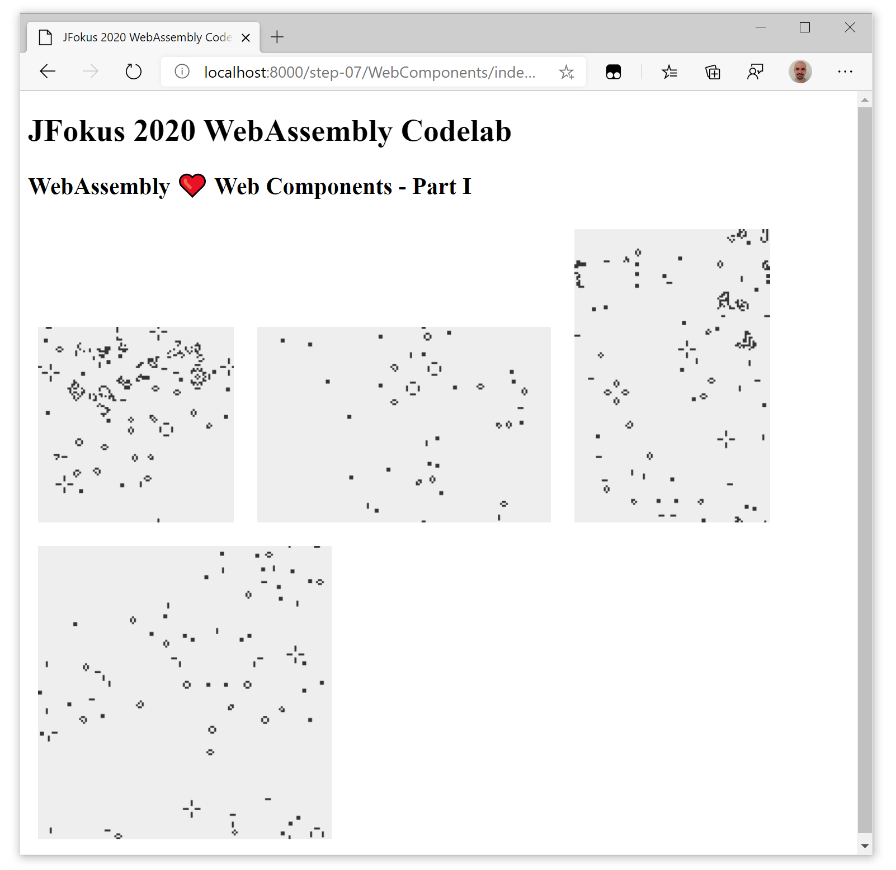

#  DevFest Paris 2020 WebAssembly Codelab - Step 07 - WebAssembly ❤️ Web Components - Part II

In this step we will encapsulate the Wasm file and the associated JavaScript of the Conway's Game of Life we did in [step 05](./step-05/) into a web component.

## Including the `.wasm`

Let's begin by including the `.wasm` file we generated in [step 05](./step-05/). It should be in the `out` folder of the `GameOfLife` project, a file called `main.wasm`.
Copy it in ourin the `GameOfLife` folder of the `WebComponents` project.

## Adding the JavaScript *glue*

In the [step 05](../step-05/) we added all the needed *glue* in a `main.js` file. 
We need now to repatriate that code to ourcustom element... but in a smart way.

### The canvas

Let's begin by adding the canvas to the rendering function:

```js
  render() {
    return html`
      <div class="board">
        <canvas id="game"></canvas>
      </div>
    `;
  }
```

### Where do we put the initializing code?

Now we need to initialize it. Where is the right place to do it in the custom element?

LitElement has several [lifecycle functions](https://lit-element.polymer-project.org/guide/lifecycle) that are called at different stages of the component's life.

First, it inherits the default lifecycle callbacks from the Web Component standard:

- `connectedCallback`: Invoked when a component is added to the document’s DOM.
- `disconnectedCallback`: Invoked when a component is removed from the document’s DOM.
- `adoptedCallback`: Invoked when a component is moved to a new document.
- `attributeChangedCallback`: Invoked when component attribute changes.

And it adds some others, specific to LitElement, but we will only need one of them in this codelab: `firstUpdated`, called after the element’s DOM has been updated the first time. It's the perfect spot to add our initialization code, as we need to initialize the canvas after it has been put in the DOM by the `render` function. 

### Initializing the canvas

As the canvas is in the ShadowDOM section of the custom element, we cannot simple use `document.getElementById()`, as it isn't accessible from the `document` object. We need to use the `shadowRoot` of our element:

```js  
  firstUpdated() {
    super.connectedCallback();
    // Set up the canvas with a 2D rendering context
    const canvas = this.shadowRoot.getElementById('game');
    this.context = canvas.getContext('2d');
  }
```

In the precedent step we added two properties to the element, `boardWidth` and `boardHeight`. Now we are going to use their values as default value for the dimensions of the game of life, also in `firstUpdated`:


```js  
  firstUpdated() {
    ...
    /*
     * We base the canvas dimensions on the board dimensions
     * and we define a cellule size of 2px
     */ 
    canvas.width = ( this.boardWidth * 2 );
    canvas.height = ( this.boardHeight * 2 );

    // memory required to store either input or output
    this.size = this.boardWidth * this.boardHeight;
    
    // total memory required to store input and output
    this.totalMemoryRequired = this.size + this.size; 
    
    // Compute the size of and instantiate the module's memory
    const numberPages = ((this.totalMemoryRequired + 0xffff) & ~0xffff) >>> 16; // aligned up in 64k units  
    this.wasmMemory = new WebAssembly.Memory({ initial: numberPages });

  }
```

We can end the initialization by calling it a `loadAndInstantiate` method that will fetch and instantiate the WebAssembly:

```js
  firstUpdated() {
    ...
    this.loadAndInstantiate();
  }
```
Now it's time to define this `loadAndInstantiate` method, used by the custom element to asynchronously load the Wasm module.

### Load and instantiate the WebAssembly

To fetch the Wasm file from the custom element, we need to know its location, by using the [`import.meta`](https://developer.mozilla.org/en-US/docs/Web/JavaScript/Reference/Statements/import.meta#Syntax) property.

`import.meta.url` will give us the pathname of the component, we need to remove the filename part (`game-of-life.js`) to get the folder location.  

Then we can use the same mechanism we used in step 05.

```js
  // Fetch and instantiate the module
  async loadAndInstantiate() {
    let response = await fetch(`${import.meta.url.replace('game-of-life.js','')}/main.wasm`);
    let arrayBuffer = await response.arrayBuffer();
    this.wasmModule = await WebAssembly.instantiate(arrayBuffer, 
        { env: { memory: this.wasmMemory } });
    this.initGame();
  }
```

We now need to add the `initGame` method, that initializes the board on the Wasm module, and set the initial position by writing in the shared linear memory:

```js
  initGame(module) {
    this.wasmExports = this.wasmModule.instance.exports;
  
    // Tell the module about the universe's width and height
    this.wasmExports.init(this.boardWidth, this.boardHeight);
  
    // Fill input at [0, s-1] with random live cells
    this.linearMemory = new Uint8Array(this.wasmMemory.buffer);
    for (let y = 0; y < this.boardHeight; ++y)
      for (let x = 0; x < this.boardWidth; ++x)
      this.linearMemory[y * this.boardWidth + x] = Math.random() > 0.1 ? 0 : 1;
  
    // Update about 30 times a second
    const desiredFps = 30;
    this.frameDuration = 1000 / desiredFps;  
    this.updateCanvas();
    this.renderCanvas();
  }
```

The `updateCanvas` need to be called 30 times per second, and at every call it will 
execute a step on the Wasm module:

```js
  updateCanvas() {
    setTimeout(this.updateCanvas.bind(this),this.frameDuration);
    this.wasmExports.step();
    // copy output at [size, totalMemoryRequired] to input at [0, size]
    this.linearMemory.copyWithin(0, this.size, this.totalMemoryRequired);
  }
```

And the `renderCanvas` will simply update the canvas at the maximum animation rate of the browser.

```js
  /*
   * Poorly optimised render function
   * Easily bigger bottleneck than the actual module
   */ 
  renderCanvas() {
    this.context.fillStyle = 'rgba(238,238,238,0.67)';
    this.context.fillRect(0, 0, this.boardWidth << 1, this.boardHeight << 1);
    this.context.fillStyle = '#333';

    for (var y = 0; y < this.boardHeight; ++y)
      for (var x = 0; x < this.boardWidth; ++x)
        if (this.linearMemory[this.size + y * this.boardWidth + x])
          this.context.fillRect(x << 1, y << 1, 2, 2);      
    requestAnimationFrame(this.renderCanvas.bind(this));
  }
```

### Clean the style

Let's make the custom element look smarter by modifying the `style` static function:

```js
  static get styles() { 
    return css`
      .board {
        display: inline-block;
        margin: 10px;
      }
    `;
  }
```

## Using the custom element

Now we can at last see the benefits of creating the custom element to encapsulate the WebAssembly: it can be integrated in any web application (or simple website) as simply as any other HTML tag.

Let's add some of them to our page, on `index.html`:

```html
<!DOCTYPE html>
<html lang="en">
<head>
    <meta charset="utf-8">
    <link rel="shortcut icon" href="data:image/x-icon;," type="image/x-icon"> 
    <title>DevFest Paris 2020 WebAssembly Codelab - WebAssembly ❤️ Web Components - Part I</title>
    <script type="module" src="./GameOfLife/game-of-life.js"></script>
</head>
<body>
    <h1>DevFest Paris 2020 WebAssembly Codelab</h1>
    <h2>WebAssembly ❤️ Web Components - Part I</h2>

    <game-of-life></game-of-life>
   
    <game-of-life boardWidth="150"></game-of-life>

    <game-of-life boardHeight="150"></game-of-life>

    <game-of-life boardWidth="150" boardHeight="150"></game-of-life>

</body>
</html>
```




